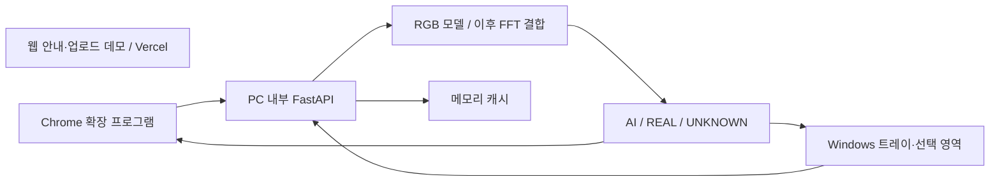

# AI-Guard 구현 기준

기준 문서: `AI_Guard_실시간_AI이미지_탐지_시스템_설계서.docx`, v1.0, 2026-09-10.
이 파일은 문서의 요구사항을 현재 코드와 대응시킨 구현 계획이다. 계획된 기능을 구현 완료로 간주하지 않는다.

## 전체 구성

Vercel 웹페이지는 다른 웹사이트의 이미지를 감지하거나 Windows 화면을 감시할 수 없다. 자동 탐지는 설치형 Chrome 확장 프로그램, PC 화면 분석은 Windows 앱이 담당한다. `localhost`는 운영 웹사이트 대신 쓰는 임시 호스팅이 아니라, 이 설계에서 사용자 PC의 모델에 접근하는 내부 통로다. 공개 웹페이지와 로컬 서비스는 별도 실행·배포 단위다.

## 현재 구현 상태

| 범위 | 상태 |
|---|---|
| 이미지 업로드·검증·미리보기 | 구현됨 |
| AI-Guard 브랜드·3종 판정 결과 화면 | 데모 구현 |
| 초기 임계값 정책과 경계값 검사 | 구현됨, 운영 보정 전 |
| 학습 모델·실측 정확도 74% | 파일 및 평가 결과 미확인 |
| FastAPI·Chrome 자동 배지 | 미구현 |
| Windows 트레이·선택 영역 캡처 | 미구현 |
| FFT·Grad-CAM·평가 실험 | 미구현 |

현재 화면의 72%는 이미지와 무관한 고정 예시다. 모델 추론, confidence, latency, RGB/FFT 점수, 히트맵을 가짜로 생성하지 않는다. 기존 74% 정확도는 설계서에 적힌 기준선이며 검증된 프로젝트 성능으로 홍보하지 않는다.

## 1단계: 기존 모델 확인

필요한 입력: 가중치 경로, 모델 구조 코드, AI/REAL 라벨 순서, 입력 크기·정규화·크롭, 평가 split과 생성기 메타데이터. 이 자료 없이 임의 모델로 기존 모델을 대체하지 않는다. 동일 split에서 confusion matrix, AI precision/recall/F1, ROC-AUC 및 처리 시간을 기록한다.

## 2단계: 로컬 추론 API

예정 구조: `app/main.py`, `app/inference/`, `app/common/`, `models/`.

| API | 계약 |
|---|---|
| `GET /health` | 서비스 생존 여부와 모델 준비 여부를 따로 반환 |
| `GET /model/info` | 버전, 입력 크기, 클래스 순서, 보정 상태, 임계값 |
| `POST /predict` | multipart 이미지 1장 → 판정 결과 |
| `POST /predict/batch` | 단일 추론 안정화 후 추가 |

예정 결과 필드: `label`, `ai_probability`, `confidence`, `decision`, `model_version`, `latency_ms`. `confidence`의 정의와 calibration 방법은 실제 모델을 확인한 후 명시한다. UNKNOWN은 제3의 학습 클래스 확률이 아니라 이진 확률의 판정 유보다. 처리 실패·모델 미연결은 오류로 반환하며 정상 UNKNOWN과 혼동하지 않는다.

초기 정책: P(AI) ≤ 0.20은 REAL, ≥ 0.80은 AI, 그 사이는 UNKNOWN. 최종 임계값은 validation 데이터로 보정하며 서버가 최종 판정을 소유한다. 웹 데모용 `src/decision.js`는 현재 설계 예시만 표현한다.

모델은 프로세스 시작 시 한 번 로드하고, UI와 추론을 분리한다. 업로드 크기뿐 아니라 디코딩 후 픽셀 수도 제한한다. 요청 제한·타임아웃·제한된 추론 대기열을 적용한다. SHA-256 캐시는 용량과 만료 시간을 제한하고 모델 버전·전처리·정책 변경을 키에 반영한다. 로그·원본 저장은 기본 OFF다.

로컬 서비스는 loopback에만 바인딩하고 설치별 인증 토큰 및 명시적인 허용 출처를 사용한다. 임의 웹사이트가 PC 모델을 호출하게 만들지 않는다. 웹페이지에서 로컬 API를 연결할 경우 브라우저의 로컬 네트워크 권한과 HTTPS 제약을 별도로 검증한다.

## 3단계: Chrome MVP

Manifest V3 확장 프로그램에서 사용자가 허용한 사이트의 화면에 보이는 ``부터 처리한다. MutationObserver와 가시성 관찰, 동시 요청 제한, 해시 캐시를 사용한다. 동적 이미지 변경·제거 시 배지와 요청 상태도 정리한다. 팝업 ON/OFF와 사이트 제외 기능을 제공한다.

이미지 바이트는 PC 내부 API로만 전달한다. 교차 출처 이미지·인증이 필요한 이미지의 접근 실패를 판정 결과로 위장하지 않는다. canvas·CSS background-image는 후속 범위다. 공개 웹사이트에 가짜 '실시간 탐지 ON' 토글을 만들지 않는다.

## 4단계 이후

1. PySide6 트레이와 사용자가 선택한 영역 캡처를 연결한다. 전체 화면을 외부로 보내지 않는다.
2. RGB/FFT 비교·앙상블·보정 후 실제 점수와 설명 이미지를 제공한다. FFT 시각화와 모델의 인과적 판단 근거는 구분한다.
3. 생성기를 분리한 unseen 평가, JPEG 90/70/50, resize·blur·screenshot 변형 실험을 수행한다. 같은 원본의 변형은 동일 split에 둔다.
4. 원클릭 시작·종료·장애 복구를 검증하고 Windows 패키징 및 시연을 준비한다.

F1 0.85/0.75, CPU 약 2초·GPU 약 1초는 목표이며 측정값이 아니다. 각 단계는 실제 실행 증거와 평가 결과를 확보한 뒤 완료로 표시한다.
